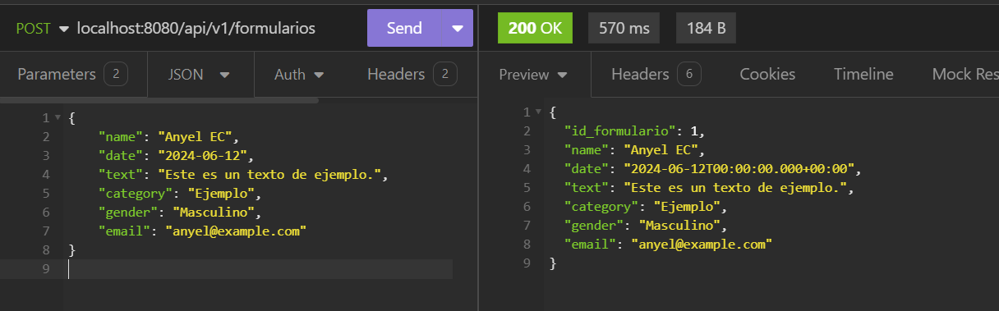
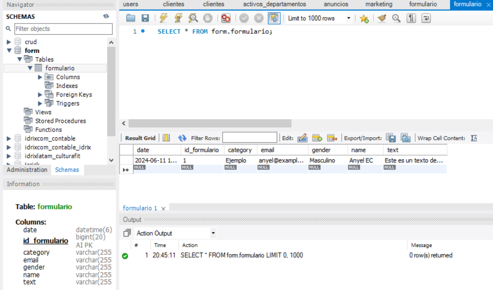

# **Select Language:** 🌍
- [Español (Spanish)](README-es.md)
- [English](README.md)


# MySQL-Angular-Form

## Overview

MySQL-Angular-Form is a Spring Boot project that provides a RESTful API for performing CRUD (Create, Read, Update, Delete) operations on a MySQL database. The project is configured to handle form data and includes cross-origin resource sharing (CORS) configuration to allow API requests from any origin.

## RESULTS
### API

### BD


## Features

- Create, Read, Update, and Delete operations on form data.
- CORS configuration to allow API requests from any origin.
- MySQL database integration using Spring Data JPA.
- RESTful API endpoints to manage form data.

## Project Structure

- **Config:** Contains configuration files for CORS settings.
- **Controller:** Handles incoming HTTP requests and sends responses.
- **Model:** Defines the data structure for the form.
- **Repository:** Provides an interface for CRUD operations on the database.
- **Service:** Contains business logic and interacts with the repository.

## Getting Started

### Prerequisites

- Java 17 or higher
- Maven 3.6.3 or higher
- MySQL 8.0 or higher

### Installation

1. **Clone the repository:**
   ```bash
   git clone https://github.com/Anyel-ec/Spring-Boot-MySQL-RestAPI-Form-BackendToAngular
   cd Spring-Boot-MySQL-RestAPI-Form-BackendToAngular
   ```

2. **Configure the MySQL database:**
    - Create a database named `form`.
    - Update the database credentials in `application.properties`:
      ```properties
      spring.datasource.url=jdbc:mysql://localhost:3306/form
      spring.datasource.username=root
      spring.datasource.password=yourpassword
      ```

3. **Build the project:**
   ```bash
   mvn clean install
   ```

4. **Run the application:**
   ```bash
   mvn spring-boot:run
   ```

### API Endpoints

- **GET /api/v1/formularios**
    - Retrieve all form entries.

- **GET /api/v1/formularios/{id}**
    - Retrieve a specific form entry by ID.

- **POST /api/v1/formularios**
    - Create a new form entry.

- **PUT /api/v1/formularios/{id}**
    - Update an existing form entry by ID.

- **DELETE /api/v1/formularios/{id}**
    - Delete a form entry by ID.

### Configuration Files

- **application.properties:**
  ```properties
  spring.application.name=MySQL-Angular-Form
  spring.datasource.url=jdbc:mysql://localhost:3306/form
  spring.datasource.username=root
  spring.datasource.password=yourpassword
  spring.datasource.driver-class-name=com.mysql.cj.jdbc.Driver

  spring.jpa.show-sql=true
  spring.jpa.hibernate.ddl-auto=create-drop

  server.port=8080
  ```

### Maven Dependencies

- **pom.xml:**
  ```xml
  <dependencies>
      <dependency>
          <groupId>org.springframework.boot</groupId>
          <artifactId>spring-boot-starter-data-jpa</artifactId>
      </dependency>
      <dependency>
          <groupId>org.springframework.boot</groupId>
          <artifactId>spring-boot-starter-web</artifactId>
      </dependency>
      <dependency>
          <groupId>com.mysql</groupId>
          <artifactId>mysql-connector-j</artifactId>
          <scope>runtime</scope>
      </dependency>
      <dependency>
          <groupId>org.projectlombok</groupId>
          <artifactId>lombok</artifactId>
          <optional>true</optional>
      </dependency>
      <dependency>
          <groupId>org.springframework.boot</groupId>
          <artifactId>spring-boot-starter-test</artifactId>
          <scope>test</scope>
      </dependency>
  </dependencies>
  ```

## Usage

Once the application is running, you can use tools like Postman or cURL to interact with the API. For example, to create a new form entry, send a POST request to `http://localhost:8080/api/v1/formularios` with the form data in the request body.

## License

This project is licensed under the MIT License.

## Acknowledgements

- Spring Boot
- MySQL
- Lombok

For further assistance, please refer to the [Spring Boot Documentation](https://spring.io/projects/spring-boot) and [MySQL Documentation](https://dev.mysql.com/doc/).


